<h1>Hey, I'm Shazia Zameer 👋</h1>
<h3>Full-Stack Web Developer · BTech CSE (AI), University of Lucknow</h3>

  
  
  
  

<h3><code>shazia@github ~ $ ./contributions.sh</code></h3>

  

<h3><code>shazia@github ~ $ whoami</code></h3>
<table>
  <tr>
    <td valign="top"></td>
    <td valign="top"></td>
  </tr>
</table>

 

<h3><code>shazia@github ~ $ ls projects/ --featured</code></h3>

| Project | Stack | Links |
|---|---|---|
| **BitLinks** — full-stack URL shortener with custom aliases, dynamic redirects, and a contact workflow | Next.js · MongoDB Atlas · Resend · Tailwind | [Live](https://bitlinks.datendiva.me) · [Repo](https://github.com/Shazia-Zameer-999/BitLinks) |
| **Linktree Clone** — link-in-bio platform with custom handles and profile pages | Next.js App Router · MongoDB · GSAP | [Live](https://linktree.datendiva.me) · [Repo](https://github.com/Shazia-Zameer-999/Linktree) |
| **Get Me a Chai** — creator funding platform with OAuth and Razorpay payments | Next.js · NextAuth.js · Razorpay · MongoDB | [Live](https://buymeachai.datendiva.me) · [Repo](https://github.com/Shazia-Zameer-999/get-me-a-chai) |
| **Headless Shopify Store** — e-commerce storefront with wishlist and persistent carts | Next.js · Shopify Storefront API · Sanity CMS | [Live](https://shop.datendiva.me) · [Repo](https://github.com/Shazia-Zameer-999/shopify_demo) |
| **ShazBlog** — publishing platform with multi-provider OAuth and GridFS media storage | Flask · MongoDB · PyMongo · Bootstrap 5 | [Live](https://shazblog.datendiva.me/) · [Repo](https://github.com/Shazia-Zameer-999/flask-blog) |

<h3><code>shazia@github ~ $ cat skills.txt</code></h3>

